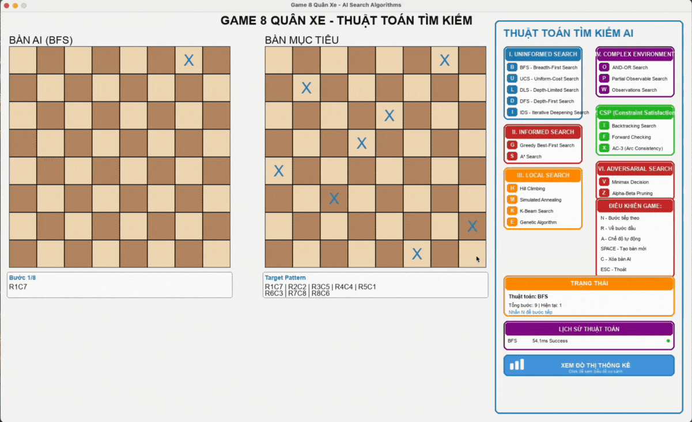
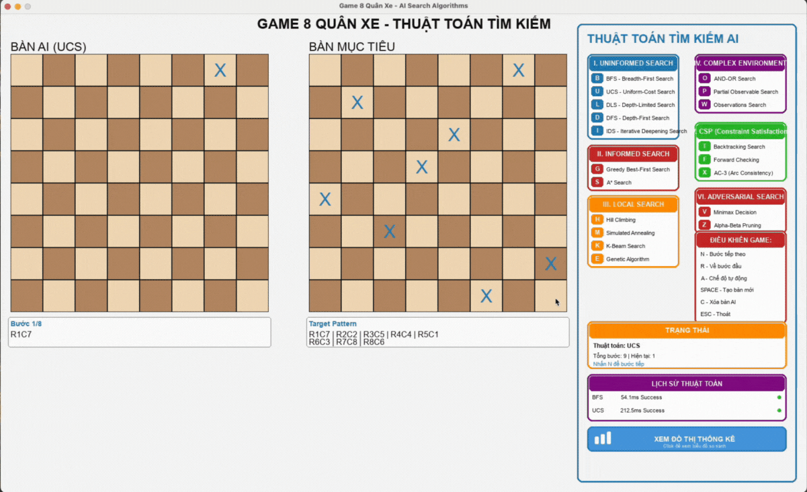
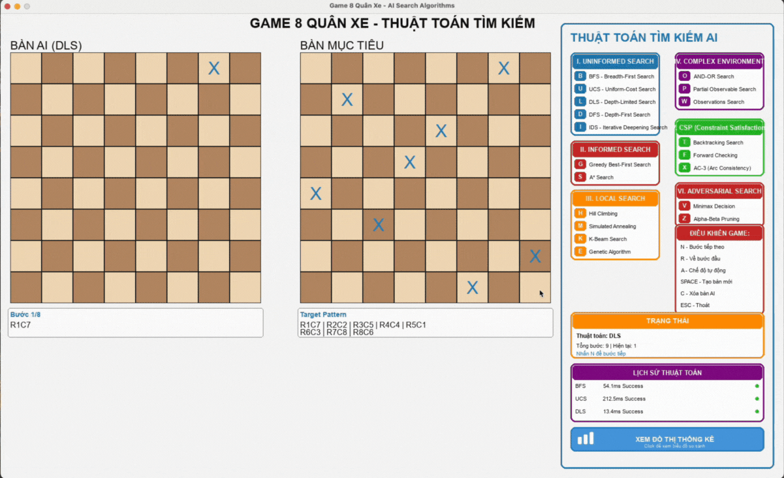
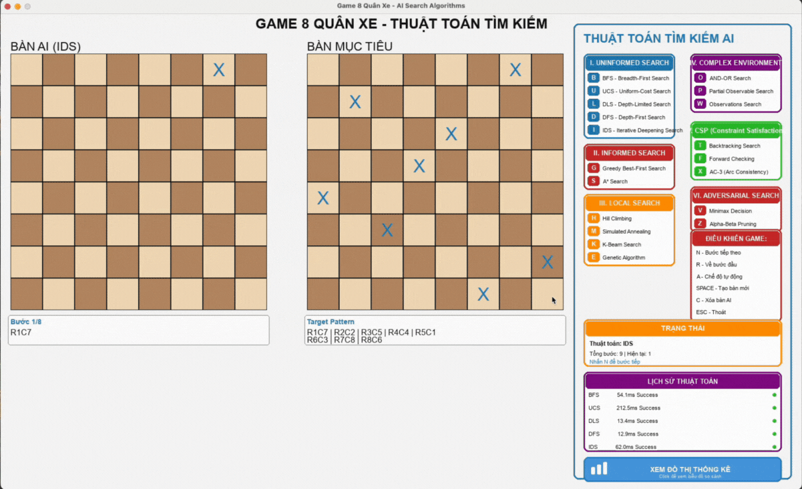
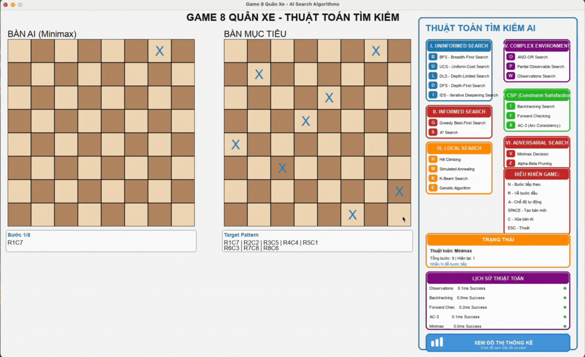

# BÀI TOÁN 8 QUÂN XE (Eight Rooks Problem)

Dự án giải quyết bài toán 8 quân xe bằng các thuật toán tìm kiếm AI.

## Giới thiệu
**Sinh viên thực hiện:** [Nguyễn Lê Đức Tuệ]  
**MSSV:** [23110165]  
**Lớp:** [05]  
**Giảng viên hướng dẫn:** TS. Phan Thị Huyền Trang


Bài toán 8 quân xe yêu cầu đặt 8 quân xe trên bàn cờ 8×8 sao cho không có 2 quân xe nào cùng hàng hoặc cùng cột.

**Mục tiêu dự án:**
- Triển khai các thuật toán tìm kiếm AI
- So sánh hiệu suất của các thuật toán
- Trực quan hóa quá trình tìm kiếm

## Cài đặt

```bash
# Clone repository
git clone https://github.com/tuenguyenprograming1003/Game-8Rocks.git
cd Game-8Rocks

# Cài đặt dependencies
pip install -r requirements.txt
```

## Cấu trúc dự án

```
Game-8Rocks/
├── Alg/                         # Các thuật toán tìm kiếm
│   ├── bfs.py                  # Breadth First Search
│   ├── dfs.py                  # Depth First Search
│   ├── ucs.py                  # Uniform Cost Search
│   ├── dls.py                  # Depth Limited Search
│   ├── ids.py                  # Iterative Deepening Search
│   ├── greedy.py               # Greedy Best-First Search
│   ├── astar.py                # A* Search
│   ├── beam_search.py          # Beam Search
│   ├── hill_climbing.py        # Hill Climbing
│   ├── simulated_annealing.py  # Simulated Annealing
│   ├── genetic.py              # Genetic Algorithm
│   ├── backtracking.py         # Backtracking
│   ├── forward_tracking.py     # Forward Checking
│   ├── ac3.py                  # AC3 Algorithm
│   ├── minimax.py              # Minimax Algorithm
│   ├── alpha_beta.py           # Alpha-Beta Pruning
│   ├── and_or_search.py        # AND-OR Search
│   ├── belief_state.py         # Belief State
│   ├── partial_observable.py   # Partial Observable
│   └── observations.py         # Observations
├── UI/                          # Giao diện người dùng
├── assets/                      # Hình ảnh, GIF demo
└── README.md
```

## Các thuật toán đã triển khai

### 1. Thuật toán tìm kiếm mù (Uninformed Search)

#### 1.1. BFS (Breadth First Search)

Tìm kiếm theo chiều rộng, duyệt toàn bộ các trạng thái ở mỗi cấp độ trước khi chuyển sang cấp tiếp theo.

**Cách hoạt động:**
- Sử dụng Queue (FIFO) để lưu các trạng thái cần duyệt
- Bắt đầu từ trạng thái rỗng `tuple()`, lần lượt thêm quân xe vào từng hàng
- Với mỗi trạng thái, sinh ra các trạng thái con bằng cách thêm quân xe vào cột chưa sử dụng
- Dictionary `par` lưu trạng thái cha để truy vết lại đường đi
- Dừng khi tìm được trạng thái mục tiêu hoặc đã duyệt hết



#### 1.2. DFS (Depth First Search)

Tìm kiếm theo chiều sâu, đi sâu vào một nhánh trước khi quay lại thử nhánh khác.

**Cách hoạt động:**
- Sử dụng Stack (LIFO) thay vì Queue
- Bắt đầu từ trạng thái rỗng, ưu tiên đi sâu vào một nhánh trước
- Với mỗi trạng thái, sinh các trạng thái con và đẩy vào stack
- Kiểm tra cột chưa sử dụng trước khi thêm quân xe mới
- Dictionary `par` để truy vết đường đi khi tìm được mục tiêu
- Dừng ngay khi tìm thấy trạng thái mục tiêu


#### 1.3. UCS (Uniform Cost Search)

Tìm kiếm theo chi phí đồng đều, ưu tiên mở rộng trạng thái có chi phí thấp nhất.

**Cách hoạt động:**
- Sử dụng Priority Queue (heap) với chi phí làm khóa sắp xếp
- Hàm `tinh_chi_phi()` tính chi phí dựa trên:
  - Chi phí cao (20) nếu cột đã được sử dụng
  - Chi phí thấp hơn dựa trên số quân còn lại cần đặt
- Dictionary `cost` lưu chi phí tốt nhất đến mỗi trạng thái
- Chỉ cập nhật trạng thái nếu tìm được đường đi với chi phí thấp hơn
- Đảm bảo tìm được đường đi có chi phí tối ưu



#### 1.4. DLS (Depth Limited Search)

Tìm kiếm theo chiều sâu có giới hạn, tránh vòng lặp vô hạn của DFS.

**Cách hoạt động:**
- Giống DFS nhưng giới hạn độ sâu tìm kiếm tối đa
- Trong bài toán 8 quân xe, độ sâu giới hạn thường là 8 (số hàng)
- Dừng mở rộng nhánh khi đạt độ sâu giới hạn
- Tránh được vòng lặp vô hạn nhưng có thể bỏ lỡ nghiệm nếu nằm sâu hơn giới hạn



#### 1.5. IDS (Iterative Deepening Search)

Kết hợp ưu điểm của BFS và DFS, tăng dần độ sâu tìm kiếm.

**Cách hoạt động:**
- Thực hiện DLS lặp lại với độ sâu tăng dần (0, 1, 2, ..., n)
- Với mỗi độ sâu, chạy một lần DLS hoàn chỉnh
- Dừng khi tìm được nghiệm hoặc đã thử hết các độ sâu có thể
- Tốn overhead do phải duyệt lại các node ở độ sâu nhỏ nhiều lần

**IDS với DLS:**



**IDS với DFS:**


### 2. Thuật toán tìm kiếm có heuristic (Informed Search)

#### 2.1. Greedy Best-First Search

Sử dụng hàm heuristic để đánh giá và chọn trạng thái tốt nhất.

**Cách hoạt động:**
- Sử dụng Priority Queue sắp xếp theo giá trị heuristic h(n)
- Hàm `heuristic()` đếm số vị trí khác biệt so với mục tiêu
- Luôn chọn mở rộng trạng thái có h(n) nhỏ nhất (gần mục tiêu nhất)
- Không quan tâm đến chi phí đường đi, chỉ tập trung vào khoảng cách đến đích
- Nhanh nhưng không đảm bảo tìm được nghiệm tối ưu


#### 2.2. A* (A-Star Search)

Kết hợp chi phí đường đi và heuristic để tìm nghiệm tối ưu.

**Cách hoạt động:**
- Sử dụng Priority Queue với f(n) = g(n) + h(n)
- g(n): chi phí thực từ điểm bắt đầu (tính bằng `tinh_chi_phi()`)
- h(n): ước lượng chi phí đến đích (tính bằng `heuristic()`)
- Dictionary `g_scores` lưu chi phí g tốt nhất đến mỗi trạng thái
- Chỉ cập nhật trạng thái khi tìm được đường đi có g(n) thấp hơn
- Đảm bảo tìm được nghiệm tối ưu nếu heuristic admissible


---

### 3. Thuật toán tối ưu hóa (Local Search & Optimization)

#### 3.1. Beam Search

Giới hạn số lượng trạng thái được lưu trữ ở mỗi cấp độ, chỉ giữ lại k trạng thái tốt nhất.

**Cách hoạt động:**
- Giống BFS nhưng giới hạn số lượng trạng thái trong queue
- Ở mỗi cấp độ, chỉ giữ lại k trạng thái có heuristic tốt nhất
- Tham số k (beam width) quyết định độ rộng tìm kiếm
- k nhỏ: nhanh nhưng dễ bỏ lỡ nghiệm tốt
- k lớn: chậm hơn nhưng khả năng tìm nghiệm cao hơn


#### 3.2. Hill Climbing

Thuật toán leo đồi, di chuyển đến trạng thái láng giềng tốt nhất.

**Cách hoạt động:**
- Bắt đầu từ trạng thái ngẫu nhiên
- Hàm `count_conflicts()` đếm số xung đột (cùng cột hoặc đường chéo)
- Hàm `get_neighbors()` tạo tất cả láng giềng bằng cách di chuyển từng quân xe
- Mỗi bước, chọn láng giềng có ít xung đột nhất
- Dừng khi không còn láng giềng nào tốt hơn (local optimum)
- Có thể bị kẹt tại cực tiểu địa phương


#### 3.3. Simulated Annealing

Mô phỏng quá trình ủ luyện kim loại, cho phép di chuyển đến trạng thái xấu hơn với xác suất nhất định.

**Cách hoạt động:**
- Bắt đầu từ trạng thái ngẫu nhiên với nhiệt độ cao (init_temp = 100)
- Hàm `get_random_neighbor()` tạo láng giềng ngẫu nhiên
- Chấp nhận láng giềng tốt hơn vô điều kiện
- Chấp nhận láng giềng xấu hơn với xác suất `exp(-delta/temp)`
- Nhiệt độ giảm dần theo `temp *= cool_rate` (thường 0.95)
- Nhiệt độ thấp → ít chấp nhận trạng thái xấu hơn
- Tránh được local optimum bằng cách "nhảy" ra khỏi hố


#### 3.4. Genetic Algorithm

Thuật toán di truyền, mô phỏng quá trình tiến hóa tự nhiên.

**Cách hoạt động:**
- Tạo quần thể ban đầu (population) gồm nhiều cá thể ngẫu nhiên
- Mỗi cá thể là một hoán vị của [0,1,2,3,4,5,6,7] (đảm bảo không trùng cột)
- Hàm `fitness()` đánh giá cá thể = số cột unique (max = 8)
- **Chọn lọc**: Tournament selection - chọn cá thể tốt nhất từ nhóm ngẫu nhiên
- **Lai ghép**: Order Crossover (OX) giữ tính permutation, xác suất 0.8
- **Đột biến**: Swap mutation hoán đổi 2 vị trí ngẫu nhiên, xác suất 0.1
- Lặp qua nhiều thế hệ (generations) cho đến khi tìm được nghiệm


---

### 4. Thuật toán thỏa mãn ràng buộc (Constraint Satisfaction)

#### 4.1. Backtracking

Thuật toán quay lui, thử từng giá trị cho biến và quay lại khi gặp ràng buộc vi phạm.

**Cách hoạt động:**
- Sử dụng Stack thay vì đệ quy để dễ theo dõi
- Đặt quân xe lần lượt từ hàng 0 đến hàng 7
- Hàm `is_safe_backtrack()` kiểm tra xung đột cột với các hàng trước
- Với mỗi hàng, thử tất cả các cột từ 0 đến 7
- Nếu cột hợp lệ: đặt quân xe và tiếp tục hàng tiếp theo
- Nếu không có cột nào hợp lệ: backtrack về hàng trước
- Stack lưu: `(board_state, row, next_col_to_try)`
- Trace ghi lại các hành động: TRY_ROW, PLACE, BACKTRACK, SUCCESS


#### 4.2. Forward Checking

Mở rộng backtracking, loại bỏ giá trị không hợp lệ từ miền của các biến chưa gán.

**Cách hoạt động:**
- Tương tự Backtracking nhưng thông minh hơn
- Sau khi đặt quân xe, cập nhật miền giá trị của các hàng chưa đặt
- Loại bỏ các cột xung đột khỏi miền của hàng tiếp theo
- Phát hiện sớm nhánh không có nghiệm (miền rỗng)
- Giảm số lần backtrack so với backtracking thuần
- Tăng tốc độ tìm kiếm đáng kể


#### 4.3. AC3 (Arc Consistency 3)

Thuật toán đảm bảo tính nhất quán cung (arc consistency) cho CSP.

**Cách hoạt động:**
- Tiền xử lý miền giá trị trước khi tìm kiếm
- Sử dụng queue chứa các cung (arc) cần kiểm tra
- Với mỗi cung (Xi, Xj), loại bỏ giá trị từ miền Di không thỏa ràng buộc
- Nếu miền Di thay đổi, thêm tất cả cung (Xk, Xi) vào queue
- Lặp cho đến khi queue rỗng hoặc phát hiện miền rỗng
- Giảm không gian tìm kiếm trước khi áp dụng backtracking


### 5. Thuật toán đối kháng (Adversarial Search)

#### 5.1. Minimax

Thuật toán cho trò chơi đối kháng, tối đa hóa lợi ích của mình và tối thiểu hóa lợi ích của đối thủ.

**Cách hoạt động:**
- Xây dựng cây trò chơi với 2 người chơi: MAX và MIN
- MAX tìm cách tối đa hóa điểm số
- MIN tìm cách tối thiểu hóa điểm số (cản trở MAX)
- Duyệt đệ quy cây trò chơi đến độ sâu giới hạn
- Lá cây được đánh giá bằng hàm utility
- Giá trị node được lan truyền ngược: max cho MAX, min cho MIN
- Chọn nước đi có giá trị minimax tốt nhất



#### 5.2. Alpha-Beta Pruning

Tối ưu hóa Minimax bằng cách cắt tỉa các nhánh không cần thiết.

**Cách hoạt động:**
- Cải tiến Minimax bằng cách duy trì 2 giá trị: alpha và beta
- Alpha: giá trị tốt nhất mà MAX có thể đảm bảo
- Beta: giá trị tốt nhất mà MIN có thể đảm bảo
- Cắt tỉa (pruning) khi alpha >= beta
- Nhánh bị cắt không ảnh hưởng đến kết quả cuối cùng
- Giảm số node cần duyệt từ O(b^d) xuống O(b^(d/2))
- Kết quả giống Minimax nhưng nhanh hơn nhiều


### 6. Thuật toán tìm kiếm trong môi trường không chắc chắn

#### 6.1. AND-OR Search

Tìm kiếm trong không gian bài toán có cấu trúc AND-OR.

**Cách hoạt động:**
- Mở rộng cho bài toán phân rã thành các bài toán con
- Node AND: tất cả con phải thành công
- Node OR: ít nhất một con phải thành công
- Phù hợp với bài toán có nhiều cách giải quyết
- Xây dựng cây AND-OR graph thay vì cây thông thường
- Giải pháp là một sub-graph đáp ứng điều kiện AND-OR


#### 6.2. Partial Observable

Tìm kiếm trong môi trường có thể quan sát một phần.

**Cách hoạt động:**
- Agent không quan sát được toàn bộ trạng thái môi trường
- Chỉ nhận được quan sát (observation) một phần
- Phải suy luận trạng thái thực từ quan sát
- Duy trì belief state dựa trên lịch sử quan sát
- Mỗi hành động và quan sát cập nhật belief state
- Kết hợp với belief state để ra quyết định


#### 6.3. Observations

Xử lý quan sát trong môi trường không đầy đủ thông tin.

**Cách hoạt động:**
- Module hỗ trợ cho Partial Observable
- Mô hình hóa sensor model: P(observation | state)
- Cập nhật belief dựa trên quan sát mới (Bayesian update)
- Xác định hành động tốt nhất dựa trên belief hiện tại
- Xử lý nhiễu và không chắc chắn trong quan sát
- Kết hợp nhiều quan sát để tăng độ tin cậy


---

## Cách sử dụng

```python
# Thuật toán tìm kiếm mù
python -m Alg.bfs
python -m Alg.dfs
python -m Alg.ucs
python -m Alg.dls
python -m Alg.ids

# Thuật toán tìm kiếm có heuristic
python -m Alg.greedy
python -m Alg.astar

# Thuật toán tối ưu hóa (Local Search)
python -m Alg.beam_search
python -m Alg.hill_climbing
python -m Alg.simulated_annealing
python -m Alg.genetic

# Thuật toán thỏa mãn ràng buộc
python -m Alg.backtracking
python -m Alg.forward_tracking
python -m Alg.ac3

# Thuật toán đối kháng
python -m Alg.minimax
python -m Alg.alpha_beta

# Thuật toán môi trường không chắc chắn
python -m Alg.and_or_search
python -m Alg.belief_state
python -m Alg.partial_observable
python -m Alg.observations

# Chạy tất cả và so sánh
python generate_charts.py
```

## Kết luận

### Tổng quan về các nhóm thuật toán

Dự án đã triển khai thành công **20 thuật toán tìm kiếm AI** khác nhau, được phân thành 6 nhóm chính, mỗi nhóm có đặc điểm và ứng dụng riêng biệt.

### Đánh giá các nhóm thuật toán

**1. Thuật toán tìm kiếm mù (Uninformed Search)**

Nhóm thuật toán cơ bản không sử dụng thông tin về mục tiêu:
- **BFS**: Đảm bảo tìm nghiệm nhưng tốn bộ nhớ do phải lưu trữ nhiều trạng thái
- **DFS**: Tiết kiệm bộ nhớ và thường nhanh hơn BFS khi nghiệm nằm ở nhánh đầu
- **UCS**: Phù hợp khi cần tối ưu chi phí đường đi
- **DLS & IDS**: Kết hợp ưu điểm của BFS và DFS, tránh vòng lặp vô hạn

**Nhận xét**: DFS thường cho hiệu suất tốt nhất trong nhóm này cho bài toán 8 quân xe do cấu trúc bài toán có độ sâu không lớn.

**2. Thuật toán tìm kiếm có heuristic (Informed Search)**

Nhóm thuật toán thông minh sử dụng hàm heuristic:
- **Greedy**: Rất nhanh nhờ chỉ tập trung vào khoảng cách đến mục tiêu, phù hợp khi heuristic tốt
- **A***: Cân bằng giữa chi phí thực và ước lượng, đảm bảo nghiệm tối ưu

**Nhận xét**: Greedy thường vượt trội về tốc độ khi heuristic được thiết kế tốt. A* phù hợp khi cần đảm bảo tối ưu.

**3. Thuật toán tối ưu hóa (Local Search & Optimization)**

Nhóm thuật toán giải quyết bài toán tối ưu:
- **Beam Search**: Giới hạn số trạng thái lưu trữ, cân bằng giữa BFS và Greedy
- **Hill Climbing**: Đơn giản, nhanh nhưng dễ bị kẹt tại cực trị địa phương
- **Simulated Annealing**: Khắc phục điểm yếu của Hill Climbing bằng cách chấp nhận trạng thái xấu hơn
- **Genetic Algorithm**: Mạnh mẽ với bài toán phức tạp, tìm nghiệm toàn cục tốt

**Nhận xét**: Simulated Annealing và Genetic thường cho kết quả tốt hơn Hill Climbing nhờ khả năng thoát khỏi local optimum. Beam Search hiệu quả khi cần cân bằng giữa tốc độ và chất lượng.

**4. Thuật toán thỏa mãn ràng buộc (Constraint Satisfaction)**

Nhóm thuật toán chuyên biệt cho CSP:
- **Backtracking**: Cơ bản, dễ hiểu, phù hợp với bài toán nhỏ
- **Forward Checking**: Cải thiện Backtracking bằng cách phát hiện sớm nhánh không khả thi
- **AC3**: Tiền xử lý hiệu quả, giảm không gian tìm kiếm trước khi backtracking

**Nhận xét**: Forward Checking và AC3 vượt trội hơn Backtracking thuần túy nhờ khả năng loại bỏ sớm các nhánh vô nghĩa.

**5. Thuật toán đối kháng (Adversarial Search)**

Nhóm thuật toán cho trò chơi đối kháng:
- **Minimax**: Tối ưu cho trò chơi 2 người, đảm bảo chiến lược tốt nhất
- **Alpha-Beta Pruning**: Tối ưu hóa Minimax, giảm đáng kể số node cần duyệt

**Nhận xét**: Alpha-Beta luôn ưu việt hơn Minimax thuần túy trong mọi trường hợp.

**6. Thuật toán môi trường không chắc chắn**

Nhóm thuật toán xử lý thông tin không đầy đủ:
- **AND-OR Search**: Phù hợp bài toán có cấu trúc phân rã
- **Partial Observable**: Thực tế với môi trường không quan sát đầy đủ
- **Observations**: Hỗ trợ xử lý quan sát với nhiễu

**Nhận xét**: Nhóm này cần thiết cho các ứng dụng thực tế nơi thông tin không hoàn hảo.

### Bài học kinh nghiệm

**1. Về lựa chọn thuật toán:**
- Không có thuật toán "tốt nhất" cho mọi trường hợp
- Lựa chọn phụ thuộc vào đặc điểm bài toán và yêu cầu cụ thể
- Thuật toán có heuristic thường tốt hơn nếu thiết kế heuristic hợp lý

**2. Về thiết kế heuristic:**
- Heuristic tốt là chìa khóa của thuật toán có thông tin
- Cần cân bằng giữa tính chính xác và chi phí tính toán
- Heuristic admissible đảm bảo tính tối ưu cho A*

**3. Về tối ưu hóa:**
- Sinh trạng thái theo hàng giúp giảm không gian tìm kiếm
- Phát hiện sớm các nhánh không khả thi quan trọng
- Pruning và constraint propagation rất hiệu quả

### Khuyến nghị sử dụng

**Nếu cần tốc độ cao:**
- Ưu tiên: Greedy, DFS
- Phù hợp: Bài toán cần giải pháp nhanh, không quan trọng tối ưu tuyệt đối

**Nếu cần nghiệm tối ưu:**
- Ưu tiên: A*, UCS
- Phù hợp: Bài toán chi phí quan trọng

**Nếu bài toán có ràng buộc phức tạp:**
- Ưu tiên: Forward Checking, AC3
- Phù hợp: CSP với nhiều biến và ràng buộc

**Nếu bài toán tối ưu hóa:**
- Ưu tiên: Genetic Algorithm, Simulated Annealing
- Phù hợp: Không gian tìm kiếm lớn, nhiều local optimum

**Nếu là trò chơi đối kháng:**
- Ưu tiên: Alpha-Beta Pruning
- Phù hợp: Game AI, quyết định trong môi trường cạnh tranh

### Hướng phát triển

**Cải tiến thuật toán:**
- Kết hợp nhiều thuật toán (hybrid approach)
- Tối ưu hàm heuristic bằng machine learning
- Song song hóa các thuật toán cho hiệu năng cao hơn

**Mở rộng bài toán:**
- Bài toán N quân xe với N bất kỳ
- Bài toán 8 quân hậu và các biến thể khác
- Ứng dụng vào các bài toán thực tế phức tạp hơn

**Cải thiện trực quan hóa:**
- Thêm animation chi tiết cho từng bước
- So sánh real-time nhiều thuật toán
- Dashboard phân tích hiệu suất

### Kết luận cuối cùng

Dự án đã thành công trong việc triển khai và so sánh toàn diện các thuật toán tìm kiếm AI cổ điển. Mỗi thuật toán có điểm mạnh riêng và phù hợp với từng loại bài toán cụ thể. Việc hiểu rõ đặc điểm và cách hoạt động của từng thuật toán giúp lựa chọn giải pháp tối ưu cho từng tình huống thực tế.

Bài toán 8 quân xe tuy đơn giản nhưng là nền tảng tốt để nghiên cứu và so sánh các kỹ thuật tìm kiếm, từ đó áp dụng vào các bài toán phức tạp hơn trong thực tế.

## Tác giả

**Sinh viên thực hiện:** [Nguyễn Lê Đức Tuệ]  
**MSSV:** [23110165]  
**Lớp:** [05]  
**Giảng viên hướng dẫn:** TS. Phan Thị Huyền Trang

## Tài liệu tham khảo

1. Russell, S., & Norvig, P. (2020). *Artificial Intelligence: A Modern Approach*
2. Bài giảng môn Trí tuệ nhân tạo - TS. Phan Thị Huyền Trang

## License

MIT License
